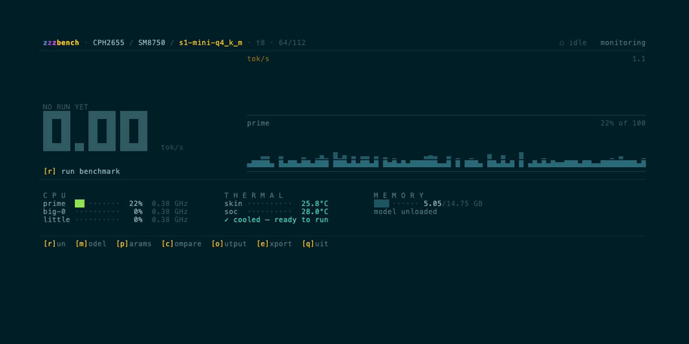

<div align="center">

<h1 align="center">zzz</h1>

<p align="center">
  <strong>High-performance inference for tiny devices.</strong><br/>
  <a href="#supported-devices">Android · Apple Silicon</a><br/>
  On-device, offline, no cloud required.
</p>

<p align="center">

[![Website][website-shield]][website-url]
[![Follow on X][twitter-shield]][twitter-url]
[![Discord][discord-shield]][discord-url]

</p>

<p align="center">

[![Build][build-shield]][build-url]
[![License][license-shield]][license-url]
[![Zig][zig-shield]][zig-url]

</p>

<!-- Primary — for-the-badge -->
[website-shield]: https://img.shields.io/badge/Website-xybrid.ai-4285F4?style=for-the-badge
[website-url]: https://www.xybrid.ai/
[twitter-shield]: https://img.shields.io/badge/Follow-%40xybrid__ai-000000?style=for-the-badge&logo=x&logoColor=white
[twitter-url]: https://x.com/xybrid_ai
[discord-shield]: https://img.shields.io/badge/Join_Discord-5865F2?style=for-the-badge&logo=discord&logoColor=white
[discord-url]: https://discord.gg/YhFHHkhbad

<!-- Project health — flat-square -->
[build-shield]: https://img.shields.io/github/actions/workflow/status/xybrid-ai/zzz/ci.yml?branch=main&style=flat-square
[build-url]: https://github.com/xybrid-ai/zzz/actions
[license-shield]: https://img.shields.io/badge/License-Apache_2.0-blue.svg?style=flat-square
[license-url]: https://opensource.org/licenses/Apache-2.0
[zig-shield]: https://img.shields.io/badge/Zig-0.16.0-F7A41D?style=flat-square&logo=zig&logoColor=white
[zig-url]: https://ziglang.org/download/
</div>

<p align="center">
  
</p>

## Quick Start

**zzzbench**, the open-source terminal app in this repository, runs a supplied
zzz engine binary directly on your device and shows what it measured.

> **Note**: Runtime downloads are not published yet. Until they are, you need a
> zzz runtime bundle or separately supplied engine and probe binaries. See the
> [Installation guide](docs/installation.md).

**Requires** [Zig 0.16.0](https://ziglang.org/download/) on macOS, plus the
engine and probe from the [Installation guide](docs/installation.md).

```sh
zig build zzzbench -Doptimize=ReleaseFast
```

This builds and launches the TUI, discovers your Mac and connected devices, and
lets you choose where to run. Connect Android phones with USB debugging enabled
and `adb` available on your Mac. Pick a device, choose a model with **`m`**, then
press **`r`** to benchmark. With only one available device, selection is automatic.

### Run with Options

Pass TUI arguments after `--`. For example, select an Android device and set the
benchmark workload:

```sh
zig build zzzbench -Doptimize=ReleaseFast -- --platform android --model example-model \
  --threads 4 --n-prompt-tokens 256 --n-generate-tokens 64
```

Replace `example-model` with a model from your catalogue. Use `--platform host`
to select your Mac, or omit `--platform` to discover all devices. You can also
change the model and parameters inside the TUI with **`m`** and **`p`**.

See the [zzzbench TUI guide](docs/usage.md) for device selection, model setup,
keyboard controls, engine comparisons, and saved results.

---

## Supported Devices

| Device | CPU | Engine build |
|--------|-----|--------------|
| Mac | Apple Silicon | Native arm64 |
| Android phone | arm64 with `i8mm` and dot product | Optimized, selected automatically |
| Android phone | arm64 without dot product | Baseline |

Phones with dot product but without `i8mm` are not supported yet: the baseline
engine refuses to run on a CPU with features it was not built for.

zzzbench itself runs on macOS. Other device architectures are reported as
unsupported.

---

## Why zzz?

- **Built for tiny devices** — arm64 phones and Apple Silicon Macs, not servers.
- **Tuned per CPU** — an optimized build picked automatically when the phone
  supports `i8mm` and dot product instructions, and a baseline build for phones
  without dot product.
- **Private / offline** — models run on the device. No cloud, no API keys.
- **Measured where it runs** — zzzbench runs the engine natively on the device
  and refuses builds for the wrong architecture, including x86 builds under
  Rosetta.
- **Numbers with receipts** — every comparison keeps the raw output its results
  were computed from.

### zzzbench

- **Live device telemetry** — CPU load and clocks per core cluster, temperatures,
  and memory on Android phones while the engine runs.
- **One-key runs** — pick a device and a model, press `r`.
- **Automatic Android setup** — finds your phone over adb, picks the right engine
  build for its CPU, and uploads binaries and models with checksum verification.
- **Engine comparisons** — run zzz against llama.cpp, or any engine described by
  an [adapter manifest](docs/adapters.md).

---

## Documentation

- [Installation](docs/installation.md) — runtime bundles, supplied binaries, environment variables
- [zzzbench TUI guide](docs/usage.md) — devices, models, parameters, comparisons, results
- [The zzz engine](docs/engine.md) — checking an engine build
- [Engine adapters](docs/adapters.md) — benchmarking other runtimes
- [Benchmark contract](BINARY_CONTRACT.md) — the zzz executable interface
- [Architecture](docs/architecture.md) — source layout and boundaries

## Community

- [Discord](https://discord.gg/YhFHHkhbad)
- [X (Twitter)](https://x.com/xybrid_ai)
- [GitHub Issues](https://github.com/xybrid-ai/zzz/issues)

## Contributing

We welcome contributions! See [CONTRIBUTING.md](./CONTRIBUTING.md) for setting up
your development environment, running the checks, and submitting pull requests.

**New here?** Browse the [`good first issue`](https://github.com/xybrid-ai/zzz/labels/good%20first%20issue)
label for small, self-contained tasks. Medium-difficulty tasks live under
[`help wanted`](https://github.com/xybrid-ai/zzz/labels/help%20wanted).

## License

The source in this repository is licensed under the Apache License 2.0 — see
[LICENSE](./LICENSE). zzz engine and probe binaries are distributed under their
own terms. See [ARTWORK.md](./ARTWORK.md) for the demo recording.
